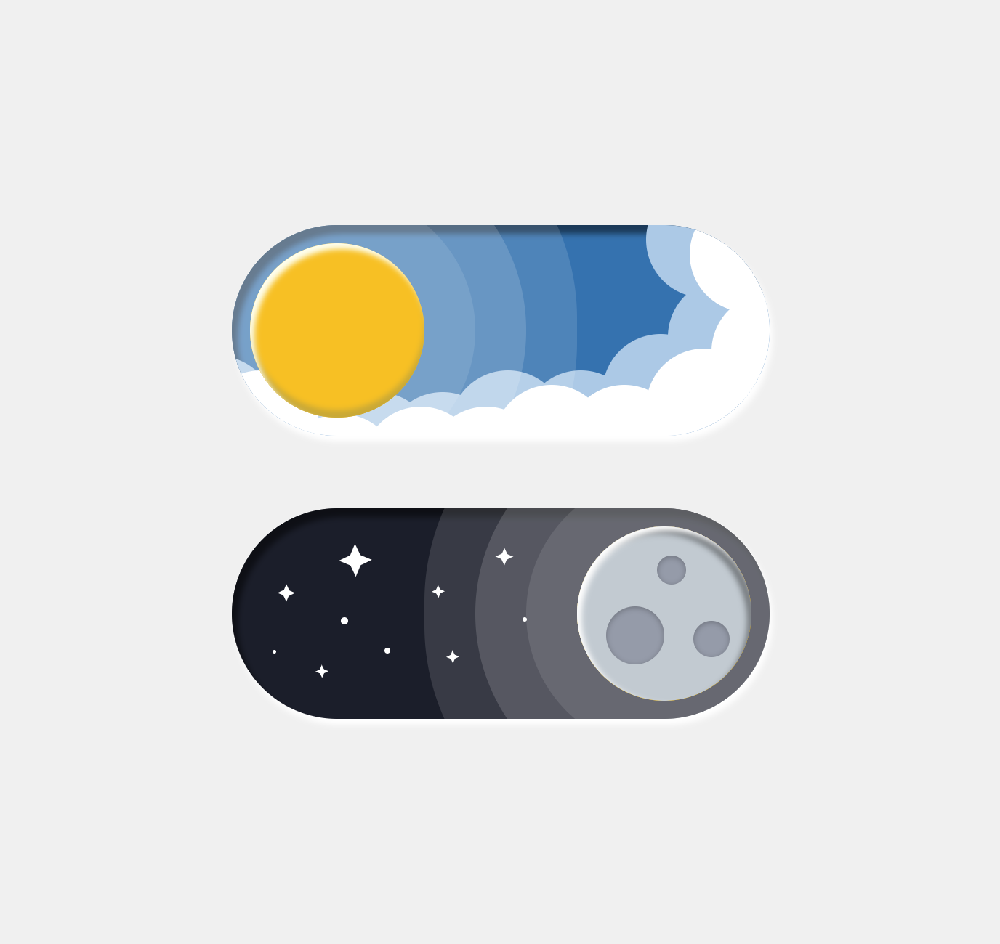

# Day\Night switcher

If you're feeling lazy to start a project, you can clone the repository and open the <code>dist/index.html</code> file in your web browser.

For start project:
 
<code>npm i</code>
 
<code>npm run dev</code>

 

